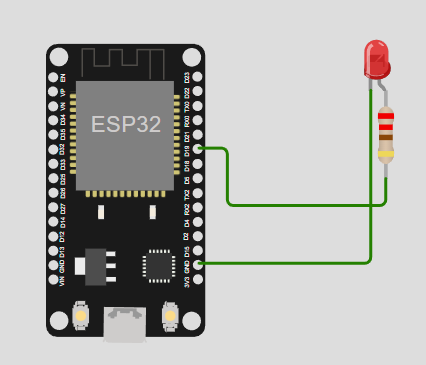

# Praktikum-IoT JOB 1 Publish Data ke MQTT Broker
Simulasi publish data dari ESP32 pada Wokwi ke broker public MQTT gratis HiveMQ
## Getting Started
### Prerequisites
- Wokwi simulation at https://wokwi.com/.
- HiveMQ websocket client at https://www.hivemq.com/demos/websocket-client/.

### Installation

1. Create wokwi project using microcontroller ESP32:
2. Create wiring diagram like a picture below:
   
3. Place your Firebase service account JSON file in the project root and rename it to `firebaseServiceAccount.json`.

4. Create a `.env` file in the project root and add your Firebase database URL:
    ```plaintext
    DATABASE_URL=https://your-firebase-database-url
    ```
