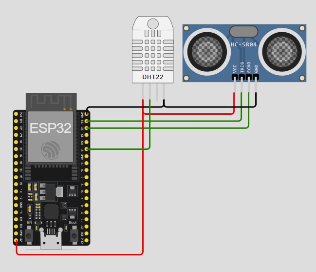
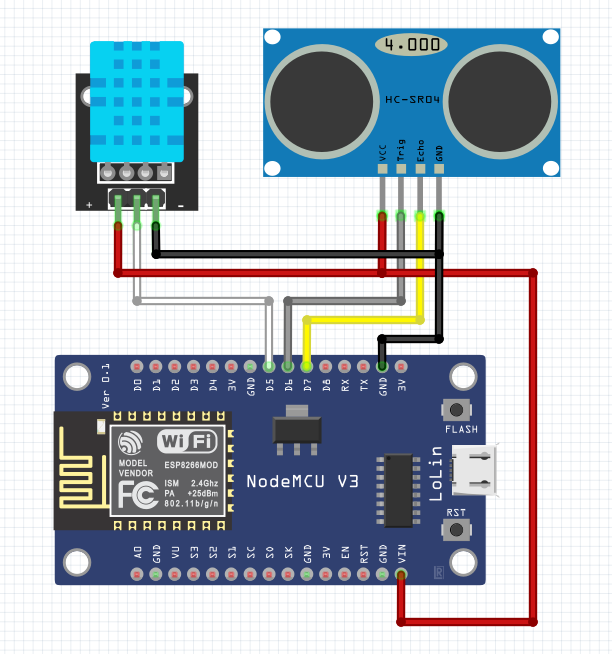

# Praktikum-IoT JOB 2 - Penggunaan Sensor dan Visualisasi
## About
Implementasi sensor dan visualisasi data menggunakan MQTT yang dikombinasikan dengan Node-RED. Job ini akan membantu memahami cara pengiriman dan tampilan data sensor dalam real-time.
## Getting Started
### Prerequisites
- Clear JOB 1a dan 1b.
- HiveMQ websocket client at https://www.hivemq.com/demos/websocket-client/.
- Node-RED installation

### Installation

1. Siapkan komponen-komponen berikut
   - ESP32 atau ESP8266
   - sensor suhu DHT11 atau DHT22
   - Sensor Ultrasonic
   - Project board
   - kabel Jumper secukupnya
   - Laptop
   - Kabel data 
3. Create wiring diagram like a picture below for ESP32:

   

   And like a picture below for ESP8266

   
   
5. Program menggunakan program (jika anda menggunakan ESP32)->  [ESP32 program](esp32-temp-distance/esp32-temp-distance.ino)
6. Program menggunakan program (jika anda menggunakan ESP8266)->  [ESP8266 program](esp8266-temp-distance/esp8266-temp-distance.ino)
7. 
8. Pada program baris ke `14` dan `15` yang berisikan program ssid dan passw ssid, silahkan sesuaikan dengan nama ssid yang akan anda gunakan untuk koneksi internet
    ```plaintext
    const char* ssid     = "your-ssid"; //your wifi ssid
    const char* password = "ssid-passw"; //your wifi password
    ```
9. Pada program baris ke `17` dan `18` yang berisikan program topic temperature dan distance, silahkan sesuaikan dengan nama topic teman-teman
    ```plaintext
    const char* temperature_topic = "your-topic/temp";
    const char* distance_topic = "your-topic/distance";
    ```
