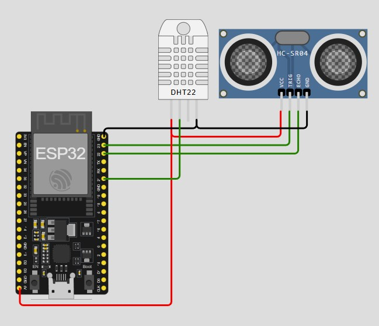
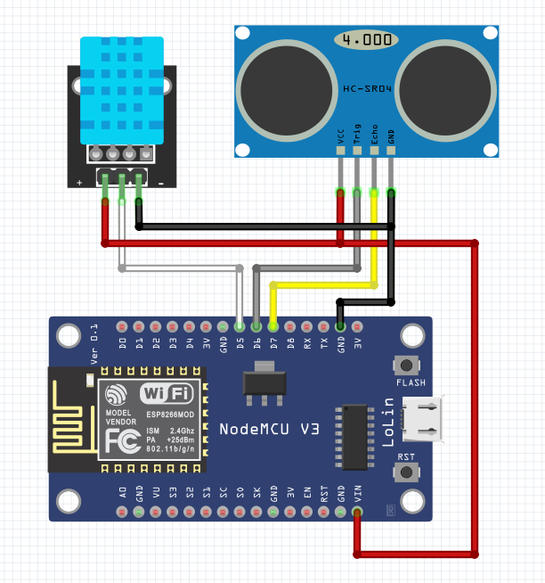

# Praktikum-IoT JOB 5 - Data Logger dengan Google Spreadsheet dan MySQL Database
## About
Job terakhir ini berfokus pada pembuatan sistem data logger dengan pencatatan data pada Google Spreadsheet dan MySQL Database untuk pengelolaan dan penyimpanan data jangka panjang.
## Getting Started
### Prerequisites
- Google account service
- Blynk installation
- Laragon or XAMPP software
- Database knowlage
- Basic Programming

### Installation

1. Siapkan komponen-komponen berikut
   - ESP32 atau ESP8266
   - sensor suhu DHT11 atau DHT22
   - Project board
   - kabel Jumper secukupnya
   - Laptop
   - Kabel data 
3. Create wiring diagram like a picture below for ESP32:

   

   And like a picture below for ESP8266

   
   
4. Pada program baris ke `14` dan `15` yang berisikan program ssid dan passw ssid, silahkan sesuaikan dengan nama ssid yang akan anda gunakan untuk koneksi internet
    ```plaintext
    const char* ssid     = "your-ssid"; //your wifi ssid
    const char* password = "ssid-passw"; //your wifi password
    ```
